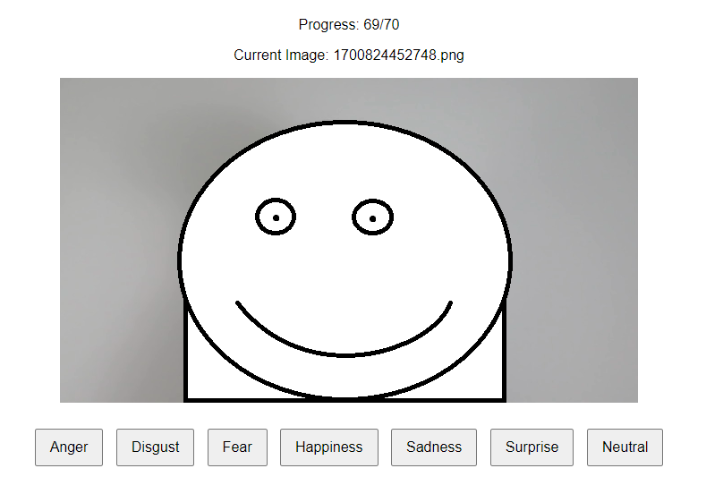

# Facial Expression Labeling Service

This repository contains a simple webservice that is intended to be used for local data labeling in the context of
facial expression recognition.
Initially, a `fer_labeler/labels.csv` file is created based on the contents of
the [images directory](fer_labeler/static/images).
Then, you have the GUI shown below available at `localhost:5000` to label images according to their facial expression.
The given labels are persisted in `fer_labeler/labels.csv`.
The order in which images are drawn is random.

Note that there also is a [gifs directory](fer_labeler/static/gifs).
If a `.gif` file with the same name as the drawn `.png` file is present in the
[gifs directory](fer_labeler/static/gifs),
the `.gif` file will be loaded next to the `.png` file.

## Getting Started

### Prepare Images

Put the images you want to label in the [images directory](fer_labeler/static/images).
Currently, the service only looks for `.png` files.

Optionally: Put the corresponding `.gif` files in the
[gifs directory](fer_labeler/static/gifs).

### Run Service

#### Python

1. Install the requirements listed in [requirements.txt](requirements.txt).
2. Run the flask app `python -m flask --app .\fer_labeler\app run`.
3. Visit `localhost:5000` with your web browser.

#### Docker

1. Build the docker image `docker build -t fels .`.
2. Start a container `docker run --rm -p 5000:5000 -v .\fer_labeler:/app/fer_labeler fels`.
3. Visit `localhost:5000` with your web browser.
